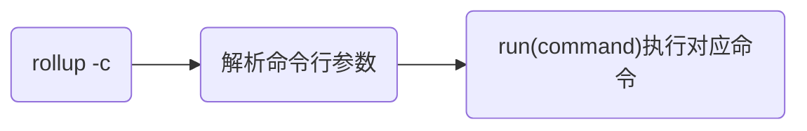
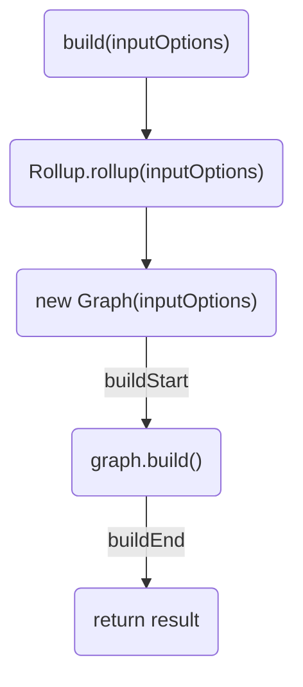
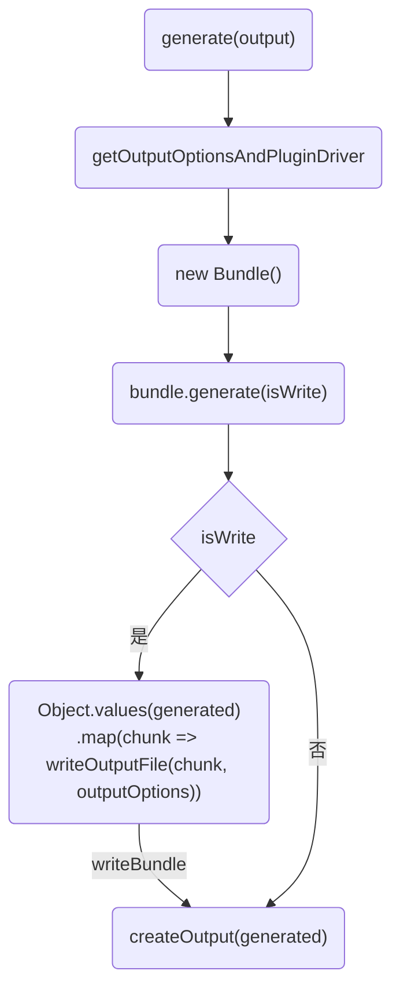

# Rollup

`Rollup`是一个`JavaScript`模块打包器，与`webpack`相比，更适用于类库的打包，最先支持`Tree Shaking`。

## 整体结构

* `Graph`: 全局唯一的图，包含入口以及各种依赖的相互关系，操作方法，缓存等。是`rollup`的核心
* `PathTracker`: 引用(调用)追踪器
* `PluginDriver`: 插件驱动器，调用插件和提供插件环境上下文等
* `FileEmitter`: 资源操作器
* `GlobalScope`: 全局作用域，相对的还有局部的
* `ModuleLoader`: 模块加载器
* `NodeBase`: `AST`各语法(ArrayExpression、AwaitExpression等)的构造基类

## 打包流程

`Rollup`的打包流程主要可以分为输入(input)、构建(build)和输出(output)三个阶段。

### 输入(input)阶段

输入(input)阶段，主要是指在命令行运行`rollup`后，解析命令行输入参数，到调用`Rollup.rollup(inputOptions)`的过程。

其整个流程比较简单，主要代码都`cli`目录下。



### 构建(build)阶段

整个构建阶段，主要是在`cli/build.js`中调用`Rollup.rollup(inputOptions)`得到一个`bundle`的过程，具体过程如下：



最后返回的是一个包含`generate`方法和`write`的类型为`RollupBuild`的对象。其类型定义如下：

```ts
export interface RollupBuild {
	cache: RollupCache | undefined;
	close: () => Promise<void>;
	closed: boolean;
	generate: (outputOptions: OutputOptions) => Promise<RollupOutput>;
	getTimings?: () => SerializedTimings;
	watchFiles: string[];
	write: (options: OutputOptions) => Promise<RollupOutput>;
}
```

### 输出(output)阶段

输出(output)阶段，主要通过调用`bundle.generate(output)`完成，`bundle.generate`方法在`Rollup.rollup`的返回值中。具体过程如下：



## 插件Plugin

`Rollup`插件是一个具有约定好的**属性**、**构建钩子**或**输出生成钩子**的对象，可以用来定制`Rollup`的行为。

因此一个`Rollup`插件中最主要的就是基于约定的钩子函数。

### 钩子函数的调用时机

钩子函数的调用时机有三类：

* `Build Hooks`，`Rollup.rollup(inputOptions)`执行的构建钩子函数
* `Output Generation Hooks`，`bundle.generate()`期间执行的输出钩子函数
* `Watch Change Hooks`， `rollup.watch`执行期间监听文件变化并重新执行构建时执行的钩子函数

### 钩子函数处理方式分类

钩子函数的调用主要由`PluginDriver`负责，主要有以下四种类型：

* 异步`async`:  处理`promise`的异步钩子，即这类`hook`可以返回一个解析为相同类型值的`promise`，同步版本`hook`也将将被转换为`sync`
* 第一个有返回值`first`:  如果多个插件实现了相同的钩子函数，那么会串式执行，从头到尾，但是，如果其中某个的返回值不是`null`也不是 `undefined`的话，会直接终止掉后续插件
* 连续`sequential`:  如果多个插件实现了相同的钩子函数，那么会串式执行，按照使用插件的顺序从头到尾执行，如果是异步的，会等待之前处理完毕，在执行下一个插件
* `parallel`:  同上，不过如果某个插件是异步的，其后的插件不会等待，而是并行执行，这个也就是我们在`rollup.rollup()`阶段看到的处理方式。

### 构建钩子函数

构建钩子函数可以影响构建执行方式、提供构建的信息或者在构建完成后修改构建。

构建钩子函数主要关注在`Rollup`处理输入文件之前定位、提供和转换输入文件。构建阶段的第一个钩子是`options`，最后一个钩子总是`buildEnd`。构建发生错误时，会触发`closeBundle`。

在观察模式下，`watchChange`钩子可以在任何时候被触发，以通知新的运行将在当前运行产生其输出后被触发。当`watcher`关闭时，`closeWatcher`钩子函数将被触发。

### 输出钩子函数

输出生成钩子函数可以提供关于生成的包的信息并在构建完成后立马执行。

输出生成阶段的第一个钩子函数是`outputOptions`，如果输出通过`bundle.generate()`成功生成则第一个钩子函数是 `generateBundle`，如果输出通过`bundle.write()`，另外如果输出生成阶段发生了错误的话，最后一个钩子函数则是 `renderError`。

`closeBundle`可以作为最后一个钩子被调用，但用户有责任手动调用`bundle.close()`来触发它。`CLI`将始终确保这种情况发生。
