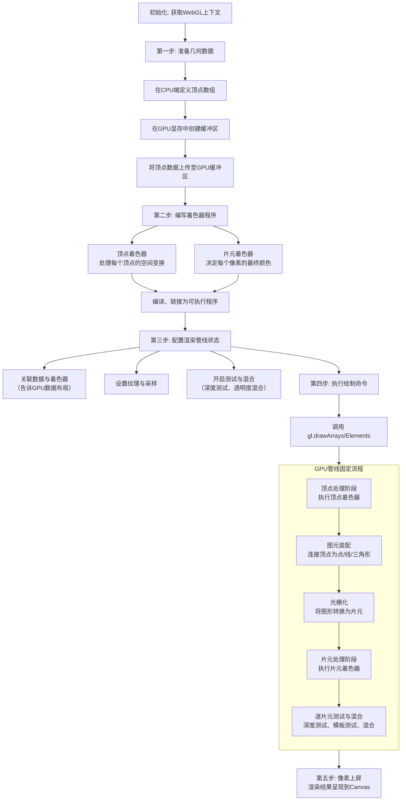
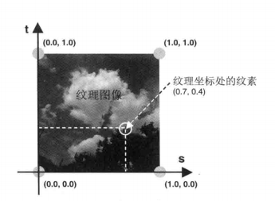

# WebGL

WebGL的渲染流程是一套**将数据（几何与图像）高效转化为屏幕像素**的精确程序。与Three.js等高级库为你封装细节不同，理解原生WebGL流程能让你真正掌握GPU渲染的核心机制。

下面这张流程图清晰地展示了从准备数据到像素上屏的完整过程，你可以结合它来理解后续的步骤分解：



### 流程步骤深度解析

#### **第零步：初始化**
获取Canvas的WebGL渲染上下文(`gl`)，它是所有后续API调用的入口。

#### **第一步：准备几何数据（CPU → GPU）**
在JavaScript中定义顶点数据（位置、颜色、纹理坐标等），然后通过`gl.createBuffer()`和`gl.bufferData()`在GPU显存中开辟空间并上传数据。这是WebGL高性能的关键——**数据一旦上传至GPU，渲染时便无需CPU反复介入**。

#### **第二步：编写与编译着色器程序**
这是WebGL的灵魂，你需要用**GLSL**编写两种着色器：
- **顶点着色器**：**处理每个顶点**。其核心任务是执行模型视图投影变换，将3D顶点坐标转换到2D屏幕坐标（`gl_Position`）。
- **片元着色器**：**处理每个像素**（更准确说是“片元”）。它决定该像素的最终颜色（`gl_FragColor`），可以应用颜色、纹理、光照计算等。

编写完成后，需调用`gl.compileShader()`和`gl.linkProgram()`进行编译和链接，最终在GPU上创建一个可执行程序。

#### **第三步：配置渲染管线状态**
在发出绘制命令前，你需要告诉GPU如何理解数据和进行渲染：
- **关联数据与着色器**：通过`gl.vertexAttribPointer()`等函数，指定GPU中缓冲区的数据如何对应到着色器中的`attribute`变量。
- **设置纹理**：如果需要贴图，需创建纹理对象、上传图片并设置采样参数。
- **启用功能**：明确开启所需功能，如深度测试(`gl.enable(gl.DEPTH_TEST)`)和混合(`gl.enable(gl.BLENDING)`)。

#### **第四步：执行绘制命令**
调用`gl.drawArrays()`或`gl.drawElements()`。这是**唯一真正启动GPU渲染流程的命令**。此命令一旦发出，之前设置的所有状态（数据、程序、纹理）将绑定在一起，GPU开始并行处理。

#### **第五步：GPU固定管线执行（自动进行）**
绘制调用触发后，GPU按照固定顺序高效执行（如图中灰色部分所示）：
1.  **顶点处理**：并行执行**顶点着色器**，处理所有顶点。
2.  **图元装配**：将顶点连接成指定的点、线或三角形。
3.  **光栅化**：将矢量的几何图形转换为栅格化的**片元**（像素）。
4.  **片元处理**：并行执行**片元着色器**，计算每个片元颜色。
5.  **测试与混合**：依次进行模板测试、深度测试（决定片元前后遮挡）和颜色混合（处理透明度）。

#### **第六步：呈现结果**
最终像素被写入帧缓冲区，并显示在Canvas元素上。

### 与Three.js的对比理解

为了帮你更好地理解WebGL的抽象层次，这里将其与Three.js的关键概念对应起来：

| WebGL 原生概念                  | 在 Three.js 中的对应体现                                      | Three.js 提供的抽象层级                                                                                                                                                        |
| :------------------------------ | :------------------------------------------------------------ | :----------------------------------------------------------------------------------------------------------------------------------------------------------------------------- |
| **缓冲区 (Buffer)** 与顶点数据  | `BufferGeometry` 及其 `attributes`（如 `position`, `normal`） | **高级对象**。你操作的是几何体对象，Three.js 在底层为你管理缓冲区的创建、填充和绑定。                                                                                          |
| **着色器程序 (Shader Program)** | `Material`（材质）及其 `Shader`                               | **高度封装**。通过内置材质（如 `MeshStandardMaterial`）或自定义着色器材质 (`ShaderMaterial`) 来定义外观，Three.js 自动生成或使用你提供的GLSL代码，并完成编译链接。             |
| **纹理状态与采样器**            | `Texture` 对象及其属性（如 `wrapS`, `magFilter`）             | **易用API**。加载图片创建纹理对象，赋值给材质的对应属性，所有繁琐的纹理单元激活、绑定等操作被隐藏。                                                                            |
| **渲染管线状态配置**            | 渲染器 (`WebGLRenderer`) 的多种设置和属性                     | **自动管理**。深度测试、混合模式等通常由材质和渲染器的默认设置或你修改的属性控制，无需直接调用 `gl.enable/disable`。                                                           |
| **绘制命令 (`gl.draw...`)**     | 网格 (`Mesh`) 的渲染                                          | **完全隐藏**。创建 `Mesh`（几何体+材质）并加入场景后，在渲染循环中调用 `renderer.render(scene, camera)`，Three.js 会自动遍历场景中的所有对象，为每个对象发出最合适的绘制命令。 |

`WebGL`使用的是右手坐标系。

## 着色器（Shader）

* 顶点着色器`Vertex Shader`: 用于描述顶点特性的程序，例如位置、颜色、纹理坐标等。顶点是指场景中的每一个点
* 片段着色器`Fragment Shader`: 进行逐片元处理过程的程序，如光照。片元是指屏幕上的每一个像素

### 变量

* `attribute`变量，用于传递顶点相关的数据，例如位置、颜色等
* `uniform`变量，用于传输所有顶点都相同的数据，例如相机位置、光源位置等
* `varying` 变量，从顶点着色器向片元着色器传输数据，只能是`float`类型

`gl.drawArrays`用于绘制场景中的对象。其中第一个参数`mode`支持7种基本图形类型：

* `gl.POINTS`：绘制点
* `gl.LINES`：绘制线
* `gl.LINE_STRIP`：绘制折线
* `gl.LINE_LOOP`：绘制闭合折线
* `gl.TRIANGLES`：绘制三角形
* `gl.TRIANGLE_STRIP`：绘制三角形带
* `gl.TRIANGLE_FAN`：绘制三角形扇

### 纹理映射

**纹理映射**`Texture Mapping`是将一张图像像一张贴纸一样映射（贴）到一个几何图形的表面上去。这样图片被称为**纹理图像**`Texture Image`或者**纹理**`Texture`。

**纹理映射**的作用就是根据纹理图像为光栅化之后的每个片元涂上合适的颜色。组成纹理图像的像素又被称为**纹素**`Texture Elements`。

**纹理映射**的步骤如下：

1. 准备好映射到几何图形上的纹理图像
2. 为几何图形配置纹理映射方式。
3. 加载纹理图像，对其相应配置
4. 在片元着色器中将响应的纹素从纹理中抽取出来，并将纹素的颜色赋给片元

**纹理图标**

几何图形到纹理的映射方式是指几何图形的某个片元的颜色如何映射到纹理图像中哪个像素的问题。利用图形的顶点坐标确定哪部分被纹理覆盖，用**纹理坐标**`Texture Coordinates`确定纹理图像的哪部分覆盖到几何图形上。

**纹理坐标**是纹理图像上的坐标，`WebGL`系统中的纹理坐标是二维的，使用`s`和`t`命名纹理坐标（st坐标系统）。



### 配置纹理

`loadTexture()`函数定义如下：

```js
function loadTexture(gl, n, texture, u_Sampler, image){
    // 首先对纹理图像进行y轴反转
    gl.pixelStorei(gl.UNPACK_FLIP_Y_WEBGL, 1);
    // 开启 0 号纹理单元
    gl.activeTexture(gl.TEXTURE0);
    // 绑定纹理对象
    gl.bindTexture(gl.TEXTURE_2D, texture);
    // 配置纹理参数
    gl.texParameteri(gl.TEXTURE_2D, gl.TEXTURE_MIN_FILTER, gl.LINEAR);
    // 配置纹理图像
    gl.texImage2D(gl.TEXTURE_2D, 0, gl.RGB, gl.RGB, gl.UNSIGNED_BYTE, image)
    // 将 0 号纹理传递给着色器中的取样器变量
    gl.uniformi(u_Sampler, 0);
}
```

在使用图像之前，必须对它进行Y轴反转，因为`WebGL`纹理坐标系统中的`t`轴方向和图片坐标系统中的`Y`轴方向是相反的。

`WebGL`通过**纹理单元**`Texture Unit`机制来同时使用多个纹理，每个纹理单元有一个单元编号来管理一张纹理图像。系统支持的个数取决于硬件和浏览器的实现，默认情况下`WebGL`至少支持8个纹理单元。因此需要使用`gl.activeTexture(gl.TEXTURE0)`方法激活纹理单元。

## GLSL ES着色器语言概述

`GLSL ES`是在`OpenGL`的基础上，删除和精简一部分功能后形成的。`WebGL`使用的`GLSL ES`版本是`1.0`，且并不支持其所有特性，而是`1.0`版本的一个子集，只包括`WebGL`需要的核心特性。

与`C`语言接近，`GLSL ES`是大小写敏感的。每个语句都应该以`;`结束。

`GLSL ES`必须有且仅有一个`main`函数，其执行是从`main`函数开始的。

`GLSL ES`是强类型语言。

### 数据值类型

`GLSL`支持仅两种数据类型：

* **数值类型**，包括整型和浮点型
* **布尔值类型**

### 变量

变量名需要符合以下规范：

* 只包括`a-z`，`A-Z`，`0-9`和`_`
* 首字母不能是数字
* 不能是`GLSL ES`关键字和保留字
* 不能以`gl_`, `webgl_`或`_webgl_`开头

### 矢量和矩阵

| 类别 | `GLSL ES`数据类型         | 描述                                  |
| ---- | ------------------------- | ------------------------------------- |
| 矢量 | `vec2`、`vec3`、`vec4`    | 具有 2、3、4 个浮点数元素的矢量       |
|      | `ivec2`、`ivec3`、`ivec4` | 具有 2、3、4 个整型数元素的矢量       |
|      | `bvec2`、`bvec3`、`bvec4` | 具有 2、3、4 个布尔值元素的矢量       |
| 矩阵 | `mat2`、`mat3`、`mat4`    | `2x2`、`3x3`、`4x4`的浮点数元素的矩阵 |

## 三维世界

### 视点和视线

**视点**`Eye Point`：观察者所在的三维空间中的位置，视线的起点。坐标用(eyeX, eyeY, eyeZ)表示。

**视线**`Viewing Direction`: 从视点出发沿着观察方向的射线。

**观察目标点**: 被观察目标所在的点。用（atX, atY, atZ）表示。

**上方向**: 最终绘制在屏幕上的图像中向上的方向。用（upX, upY, upZ）表示。

用**视点**、**观察目标点**和**上方向**可以创建**视图矩阵**`View Matrix`。

`cuon-matrix.js`提供的`Matrix4.setLookAt(eyeX, eyeY, eyeZ, atX, atY, atZ, upX, upY, upZ)`方法可以创建视图矩阵。

### 可视范围

## `WebGL`vs`WebGPU`

| 特性维度 | WebGL | WebGPU |
| :--- | :--- | :--- |
| **设计哲学与架构** | 基于 OpenGL ES 的**状态机模式**。需要逐帧设置大量状态，驱动负担重。 | 基于 Vulkan/Metal/D3D12 的**现代显式 API**。通过预定义的“管线”和“绑定组”组织资源，控制更精细。 |
| **性能与并行能力** | **单线程**渲染，易阻塞主线程。性能受限于驱动抽象层。 | 原生支持**多线程**，可通过 Worker 并行提交命令。更低的 CPU 开销和更高效的 GPU 驱动路径。 |
| **核心功能特性** | 专注于**图形渲染**。计算能力有限，依赖图形管线 hack。 | 原生支持 **`计算着色器`**，可进行通用 GPU 计算（如物理模拟、AI推理）。支持更多现代 GPU 特性。 |
| **着色器语言** | **GLSL**，运行时编译，可能导致卡顿。 | **WGSL**，设计更安全，支持预编译，类型系统更严格。 |
| **内存管理** | **隐式管理**，依赖垃圾回收，易导致内存泄漏或上下文丢失。 | **显式管理**，开发者负责创建和销毁资源，内存控制更精准、可预测。 |
| **浏览器支持** | **极其广泛**，所有现代浏览器均支持。 | **主流浏览器已全面支持**（Chrome 113+， Edge 113+， Firefox 141+， Safari 16.4+）。但部分旧设备/浏览器不兼容。 |
| **学习与开发难度** | 概念相对简单，易于入门，但优化复杂场景困难。 | **学习曲线陡峭**，需要理解现代 GPU 管线、资源绑定等概念。 |
