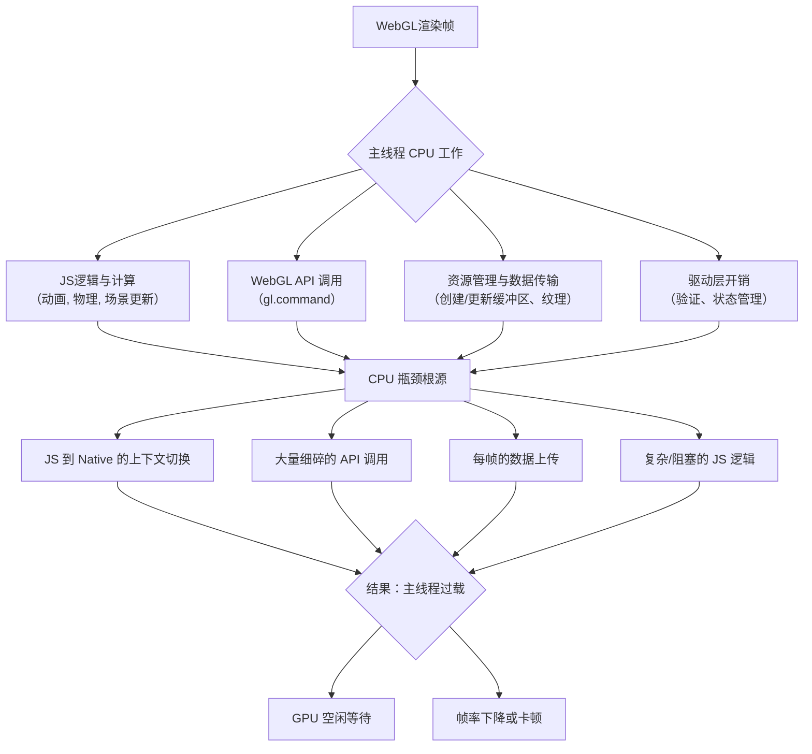

# 性能优化

## WebGL性能优化

在WebGL渲染中，**CPU瓶颈的根本原因是CPU需要为主线程（尤其是与GPU的通信）做大量准备和协调工作，如果这些工作过于繁重或低效，就会导致GPU等待，整体帧率下降。**

下面这张图清晰地揭示了WebGL渲染流程中，CPU端可能导致瓶颈的关键环节：

你可以对照上图，从以下几个核心层面来理解具体原因：

### 1. JavaScript与WebGL API的通信开销
这是最主要的原因之一。每次你调用`gl.drawArrays`或设置一个状态（如`gl.uniform`），JavaScript引擎都需要将命令和数据从JS环境“打包”并穿越边界传递到底层的图形驱动（通常是C++实现）。这个过程称为**上下文切换**，其本身就有开销。如果每帧有成千上万个这样的调用，累积的开销会非常巨大，CPU时间就浪费在“沟通”上，而不是实际计算。

### 2. 复杂的JavaScript逻辑与计算
所有驱动渲染的逻辑都在CPU上执行：
*   **场景管理与矩阵计算**：遍历场景图、计算每个对象的模型矩阵、更新相机视图投影矩阵。
*   **动画与状态更新**：计算骨骼动画、粒子运动、物理模拟等。
*   **业务逻辑**：游戏逻辑、用户输入处理等。
如果这些**JavaScript逻辑本身过于复杂或未经优化**，会直接占用大量主线程时间，推迟了渲染命令的提交。

### 3. 低效的资源管理与数据上传
**“每帧创建”是性能杀手**：
*   在每一帧都创建新的`Buffer`、`Texture`或`Program`。
*   使用`gl.bufferData`或`gl.texImage2D`**频繁上传**新的几何体或纹理数据到GPU。WebGL中，从CPU内存（如JS的`TypedArray`）传输数据到GPU显存是**同步且缓慢**的操作，会严重阻塞管线。

### 4. 频繁的WebGL状态切换
WebGL是一个巨大的状态机。诸如`gl.enable`/`gl.disable`、切换当前使用的`program`、`texture`等操作，都会改变内部状态。如果绘制调用之间穿插着大量、杂乱的状态变更，驱动需要做很多检查和设置工作，从而降低了效率。

### 5. 单线程与阻塞
WebGL操作通常在主线程执行。如果主线程被其他任务（如复杂的JavaScript计算、DOM操作、甚至`console.log`）阻塞，那么渲染命令的提交就会延迟，导致GPU闲置，FPS（每秒帧数）下降。

### 💡优化思路与解决方案
针对以上瓶颈，优化的核心思想是：**减少CPU工作量，尤其是减少对WebGL API的调用次数和数据传输量。**

| 瓶颈原因 | 优化策略 |
| :--- | :--- |
| **API通信开销** | **批处理（Batching）**：合并多个相似物体的绘制调用，减少`gl.drawXXX`的次数。这是Three.js等库内部优化的核心。 |
| **复杂JS逻辑** | **使用Web Workers**：将非渲染逻辑（如物理、AI）移到Worker线程，避免阻塞主线程。**算法优化**：降低计算复杂度。 |
| **数据上传** | **重用对象**：尽可能复用`Buffer`、`Program`和`Texture`。**增量更新**：使用`gl.bufferSubData`更新部分数据，而非全部重传。**实例化渲染**：使用`gl.drawArraysInstanced`一次绘制多个相似物体。 |
| **状态切换** | **排序渲染**：按状态（如材质、纹理）对物体进行排序，让使用相同状态的物体连续绘制，最小化状态切换。 |
| **单线程阻塞** | **分解任务**：将大任务分解到多个帧中执行，避免单帧卡顿。**性能分析**：使用浏览器的Performance工具，精确定位耗时最长的函数。 |

## Three.js性能优化

Three.js性能优化是一个系统工程，需要从**渲染、资源、代码**三个层面协同处理。下表为你梳理了完整的优化体系与关键技术：

| 优化维度 | 核心技术 | 核心思想与操作方法 |
| :--- | :--- | :--- |
| **渲染优化** | **渲染调用合并** | **核心**：将多个`Mesh`合并为单个`BufferGeometry`，用一次`draw call`绘制。用`BufferGeometryUtils.mergeBufferGeometries()` 或 `InstancedMesh`。 |
| | **实例化渲染** | 绘制大量相同几何体但位置等属性不同时，使用 `InstancedMesh`。极高效，适合树木、人群。 |
| | **细节层次** | 使用 `LOD` 对象，根据物体与相机的距离切换不同精度的模型，减少远处物体的面数。 |
| | **视锥体裁剪** | 使用 `Frustum Culling`，默认启用。确保物体不在视锥体内时不被渲染。合理组织场景图。 |
| | **渲染目标与分辨率** | 适当降低 `WebGLRenderer` 的 `setPixelRatio` 或 `setSize`，尤其是移动端。牺牲少许清晰度换取帧率。 |
| **资源与内存优化** | **几何体优化** | 减面！建模时尽量减少顶点和三角形数。使用 `BufferGeometry` 的 `toNonIndexed()` 或简化算法。 |
| | **纹理优化** | **压缩**：使用压缩纹理格式如 `KTX2`；**合图**：小纹理合并为大图集；**复用**：不同物体共用纹理。 |
| | **材质优化** | 减少高消耗材质（如 `MeshStandardMaterial`）的使用。能用`MeshBasicMaterial`或`MeshLambertMaterial`就不用PBR材质。 |
| | **对象池与缓存** | 重用已创建的几何体、材质、纹理对象，避免每帧创建/销毁。管理好 `dispose()` 释放GPU内存。 |
| **代码与执行优化** | **1. 减少JS计算** | 将复杂计算（如物理、寻路）移至 **Web Worker**，避免阻塞渲染主线程。 |
| | **按需更新** | 数据未变时，避免在动画循环中重复计算矩阵或更新材质。 |
| | **着色器优化** | 自定义着色器 (`ShaderMaterial`) 中，减少复杂光照和分支判断；优先在顶点着色器计算。 |
| | **后期处理优化** | `EffectComposer` 的通道数尽量少，分辨率可降低。用 `MaskPass` 等局部后处理代替全屏应用。 |

### 实战优化流程与高级策略
理解技术后，按此流程操作：

1.  **定位瓶颈（先测量，后优化）**
    *   **核心工具**：使用Chrome DevTools的 **Performance** 和 **Memory** 面板分析。重点关注`scripting`(JS执行)、`rendering`(渲染)、`GPU`时间。
    *   **Three.js工具**：使用 `stats.js` 库监控实时帧率(FPS)、内存等。添加 `WebGLRenderer.info` 到控制台，查看`render`、`programs`、`geometries`等关键计数。

2.  **实施优化（从收益最大的开始）**
    *   **首要目标：减少 `draw calls`**。这是最常见的瓶颈，通过上述**渲染调用合并**和**实例化渲染**解决。
    *   **其次：降低渲染负载**。应用**LOD**和**降低分辨率**。
    *   **最后：减轻CPU负担**。将计算**移入Worker**，并保证**及时释放内存**。

3.  **高级与前瞻策略**
    *   **考虑迁移至 WebGPU**：对于复杂场景，Three.js的 `WebGPURenderer` 能带来显著性能提升（尤其是计算着色器和并行性）。
    *   **使用特定扩展**：如 `ANGLE_instanced_arrays` (实例化)、`OES_texture_float` 等，但需检查支持性。
    *   **几何体压缩与流式加载**：使用 `Draco` 或 `Meshopt` 压缩工具压缩几何体；对大世界分块流式加载。

### 场景化建议

*   **大量相似物体**（如草地、人群）：首选 **`InstancedMesh`**。
*   **单个复杂场景**（如建筑、汽车）：重点做**减面**、**LOD**和**纹理压缩**。
*   **动态数据可视化**：注意**对象池复用**，并考虑用 **Web Worker** 处理数据。
*   **移动端项目**：**必须压缩纹理**、**降低分辨率**、**简化材质和阴影**。